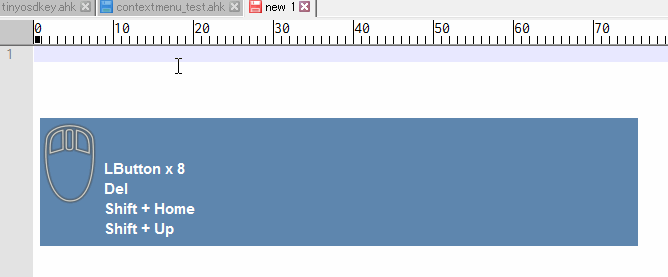

tinyosdkey
==========

Displays the key input and mouse button state on Windows on the screen.

use AutoHotKey v1.1.24.05

Screenshot
----------

System Requirements
-------------------

Windows10 x64

To Exe
------

Run ahk2exe.exe. Specify source file or output file.

License
-------

CC0 / Public Domain

