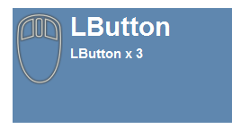
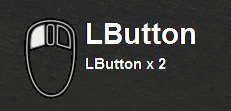
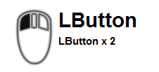

tinyosdkey
==========

Displays the key input and mouse button state on Windows on the screen.

use AutoHotKey v1.1.24.05

Screenshot
----------

System Requirements
-------------------

Windows XP 32bit / Windows 7 SP1 64bit / Windows 10 64bit

Install and run
---------------

Extract zip and run tinyosdkey.exe .

tinyosdkey.ini is generated at the initial startup. Edit ini to change setting.

Uninstall
---------

Delete the folder. Registry is unused.

To Exe
------

Run Ahk2Exe.exe. Specify source file and output file. Ahk2Exe is bundled with AutoHotkey.

Style example
-------------

You can change the style by editing tinyosdkey.ini .

    ...
    transparentv=200
    bgtransparent=0
    bgcol=336699
    fgcol=FFFFFF
    iconkind=
    ...

    ...
    transparentv=OFF
    bgtransparent=1
    bgcol=000000
    fgcol=FFFFFF
    iconkind=
    ...

    ...
    transparentv=OFF
    bgtransparent=1
    bgcol=FFFFFF
    fgcol=000000
    iconkind=b_
    ...

License
-------

CC0 / Public Domain
